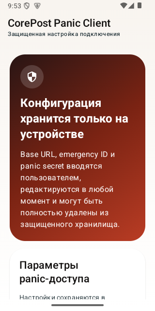
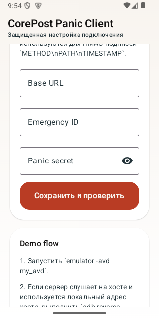
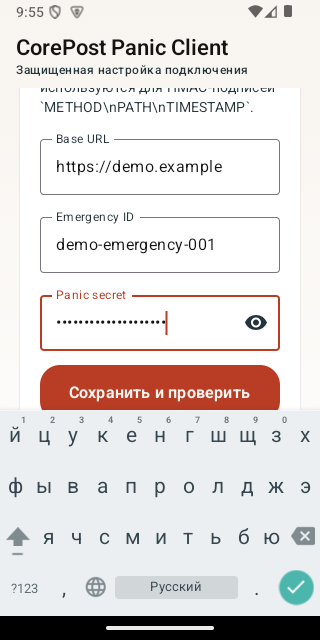
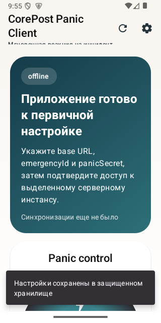
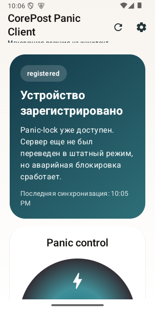
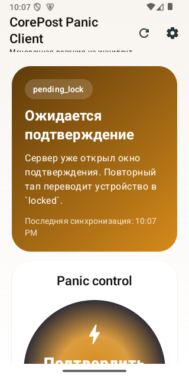
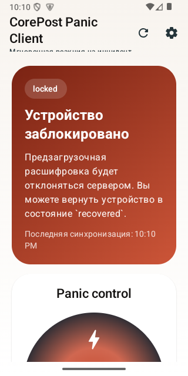
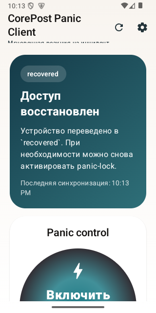

# CorePost Mobile Android

Android panic-клиент для CorePost. Приложение использует Material 3 UI, хранит `baseUrl`, `emergencyId` и `panicSecret` в `EncryptedSharedPreferences` и подписывает mobile-запросы HMAC-строкой `METHOD\nPATH\nTIMESTAMP`.

## Что есть в проекте

- Compose single-activity приложение.
- Статусы `registered`, `normal`, `pending_lock`, `locked`, `restricted`, `recovered`.
- Двухшаговый panic-lock.
- Редактируемая и очищаемая конфигурация сервера.
- Release build с fallback на debug keystore, если production-keystore еще не передан.

## Конфигурация

Адрес сервера не зашит в приложение. Пользователь вводит его вручную на onboarding-экране и может позже:

- изменить адрес;
- заменить `emergencyId` и `panicSecret`;
- полностью удалить все сохраненные параметры.

Если сервер работает по `http://`, приложение допускает cleartext traffic. Если сервер доступен по `https://`, используйте полный HTTPS URL.

## Локальный demo flow

```bash
emulator -avd my_avd
adb wait-for-device
./scripts/install_demo_on_emulator.sh
```

Если сервер запущен на хосте и в приложении используется его локальный адрес, отдельно выполните:

```bash
adb reverse tcp:<PORT> tcp:<PORT>
```

Если нужен provisioning тестового устройства через admin API:

```bash
export COREPOST_ADMIN_TOKEN='<token>'
python3 scripts/provision_demo_device.py --base-url http://host-or-lan-server:PORT
```

После этого введите в приложении:

- `Base URL`
- `Emergency ID`
- `Panic secret`

## Сборка

```bash
./gradlew assembleDebug
./scripts/build_release_apk.sh
```

Если хостовая Java слишком новая для текущего Android Gradle/Kotlin toolchain, задайте совместимую JDK 17 или 21 через `JAVA_HOME` перед сборкой.

Release APK появляется в `app/build/outputs/apk/release/`.

Для production-подписи задайте:

```bash
export COREPOST_UPLOAD_STORE_FILE='<keystore-file>'
export COREPOST_UPLOAD_STORE_PASSWORD='...'
export COREPOST_UPLOAD_KEY_ALIAS='...'
export COREPOST_UPLOAD_KEY_PASSWORD='...'
```

## Публикация

Пример публикации release APK:

```bash
gh release create android-v1.0.0 \
  app/build/outputs/apk/release/app-release.apk \
  --repo CorePost/corepost-mobile-android \
  --title "CorePost Android v1.0.0" \
  --notes-file CHANGELOG.md
```

## Тесты

```bash
./gradlew test
./gradlew connectedDebugAndroidTest
```

## Demo assets

- Скриншоты: [docs/media/screenshots/README.md](docs/media/screenshots/README.md)
- Видео: [docs/media/video/README.md](docs/media/video/README.md)

Текущие скриншоты сняты на `emulator -avd my_avd` и показывают onboarding, ошибку подключения и live-состояния panic-flow:










Доступный video asset:

- [demo-my_avd.mp4](docs/media/video/demo-my_avd.mp4) — живая запись сценария `recovered -> pending_lock -> locked -> recovered` на `my_avd`.

Для перезаписи видео:

```bash
./scripts/record_demo_video.sh
```
